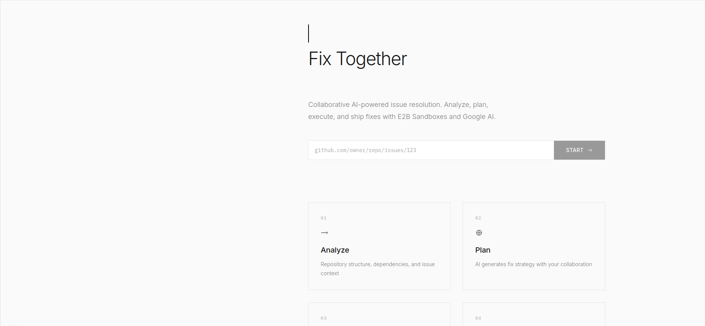
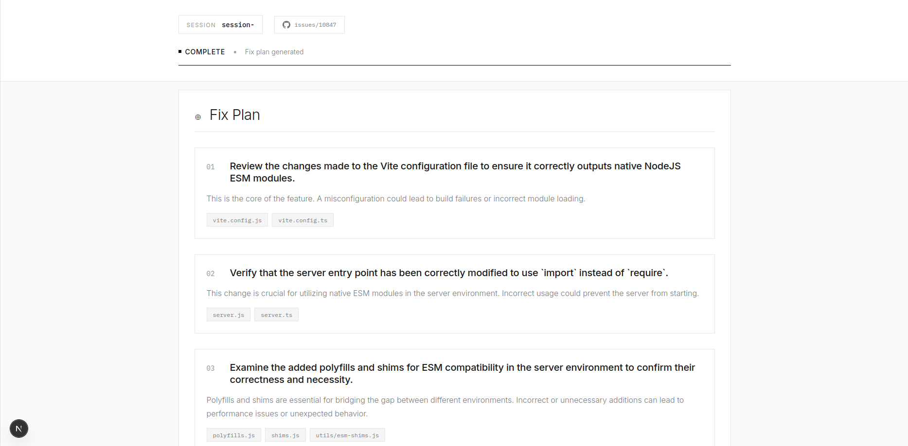

# Fix Together

A collaborative AI-powered tool for fixing GitHub issues with confidence. Built with E2B sandboxes for safe code execution and testing.

## Features

- 🔍 **Instant System Overview** - Analyzes repos, generates architecture diagrams, identifies bug areas
- 🤝 **Collaborative Fix Planning** - AI proposes fixes, you refine them together
- ✅ **Step-by-Step Execution** - Apply changes one at a time with full control
- 🚀 **Ship or Export** - Create PRs, patches, or push to your fork

## Quick Start

```bash
# Install dependencies
pnpm install

# Set up environment variables
cp .env.example .env
# Edit .env with your API keys

# Run the real issue fixer (recommended)
npx tsx run-real-issue.ts

```

### Web UI

```bash
# Navigate to frontend package
cd packages/frontend

# Create .env.local with your API keys
cat > .env.local << EOF
E2B_API_KEY=your_e2b_api_key_here
GROQ_API_KEY=your_groq_api_key_here
EXA_API_KEY=your_exa_api_key_here

PORT=3000
NODE_ENV=development
EOF

# Run development server
pnpm dev

# Open http://localhost:3000 in your browser
```

The web UI provides a Swiss-Japanese minimalist interface for:
- Submitting GitHub issue URLs
- Real-time progress tracking
- Viewing generated fix plans with AI suggestions
- Accessing recommended resources and documentation



```

## Requirements

- Node.js >= 20.0.0
- pnpm >= 8.0.0
- E2B API key ([sign up](https://e2b.dev))
- GitHub personal access token
- Google AI API key or Groq API key

## Architecture

- `packages/core` - Core engine with E2B integration
- `packages/mcp-client` - MCP server integrations
- `packages/cli` - Command-line interface
- `packages/frontend` - Next.js 16 frontend with Swiss-Japanese minimalist design

## License

MIT
