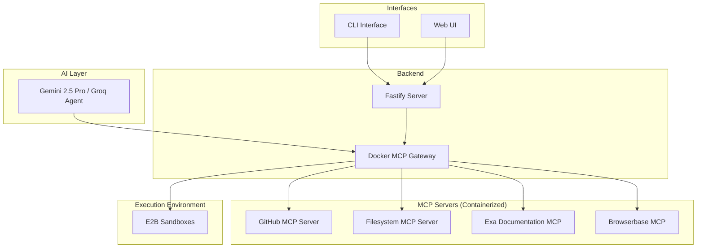

# Docker MCP Hub Integration Guide

## Overview

Docker MCP Hub provides a standardized way to package, distribute, and run MCP (Model Context Protocol) servers as containers. This guide explains how to leverage Docker MCP for the collaborative GitHub issue fixer project.

## What is Docker MCP Hub?

The **Model Context Protocol (MCP)** is an open protocol developed by Anthropic that standardizes how applications provide context and functionality to Large Language Models (LLMs). Docker MCP Hub combines:

- **MCP Protocol**: Client-server architecture where AI clients send requests and MCP servers deliver context
- **Docker Containerization**: Packages MCP servers as isolated, reproducible containers
- **Docker Hub Distribution**: Central repository for discovering and deploying MCP servers

## Key Benefits for GitHub Issue Fixer

### 1. Isolation & Security
- Each MCP server runs in its own sandboxed container
- AI agent actions don't affect the host system unless explicitly configured
- Perfect for executing untrusted code in E2B sandboxes

### 2. No Dependency Management
- Eliminates complex environment setups
- No need to manage Node.js, Python, or other runtime installations
- Consistent environments across development and production

### 3. Easy Distribution
- Package custom MCP servers as Docker images
- Share via Docker Hub for easy deployment
- Version control and rollback capabilities

## Docker Desktop Integration

Docker Desktop now includes built-in MCP support:

### MCP Toolkit
- UI to manage and run MCP servers
- "One-click" setup for different AI clients
- Simplifies connection between AI agents and MCP servers

### MCP Catalog
- Curated collection of verified MCP servers
- Similar to container images on Docker Hub
- Easy discovery and deployment of trusted tools

## Architecture for GitHub Issue Fixer



## MCP Servers for Our Use Case

### 1. GitHub MCP Server
**Purpose**: Interface with GitHub APIs

**Capabilities**:
- Fetch issues, PRs, and repository data
- Create comments and PRs
- Manage repository operations via natural language
- Access real-time GitHub data

**Docker Image**: `docker.io/mcp/github-server:latest` (or custom build)

### 2. Filesystem MCP Server
**Purpose**: Safe file system interactions

**Capabilities**:
- Read/write files in cloned repositories
- Navigate directory structures
- Isolated from host system
- Perfect for E2B sandbox integration

**Docker Image**: `docker.io/mcp/filesystem-server:latest`

### 3. Exa Documentation MCP (Custom)
**Purpose**: Search and retrieve documentation

**Capabilities**:
- Search relevant documentation for fixes
- Provide contextual code examples
- Enhance AI agent's knowledge base

**Implementation**: Custom MCP server containerized with Docker

### 4. Browserbase MCP (Custom)
**Purpose**: Visual debugging and testing

**Capabilities**:
- Render UI changes
- Capture screenshots
- Validate visual regressions
- Browser automation for testing

**Implementation**: Custom MCP server containerized with Docker

## Implementation Example

### Docker Compose Configuration

```yaml
version: '3.8'

services:
  # GitHub MCP Server
  github-mcp:
    image: docker.io/mcp/github-server:latest
    environment:
      - GITHUB_TOKEN=${GITHUB_TOKEN}
    networks:
      - mcp-network
    restart: unless-stopped

  # Filesystem MCP Server
  filesystem-mcp:
    image: docker.io/mcp/filesystem-server:latest
    volumes:
      - ./workspace:/workspace:rw
      - ./repos:/repos:rw
    networks:
      - mcp-network
    restart: unless-stopped

  # Exa Documentation MCP (Custom)
  exa-mcp:
    build:
      context: ./mcp-servers/exa
      dockerfile: Dockerfile
    environment:
      - EXA_API_KEY=${EXA_API_KEY}
    networks:
      - mcp-network
    restart: unless-stopped

  # Browserbase MCP (Custom)
  browserbase-mcp:
    build:
      context: ./mcp-servers/browserbase
      dockerfile: Dockerfile
    environment:
      - BROWSERBASE_API_KEY=${BROWSERBASE_API_KEY}
      - BROWSERBASE_PROJECT_ID=${BROWSERBASE_PROJECT_ID}
    networks:
      - mcp-network
    restart: unless-stopped

  # MCP Gateway (Optional - for dynamic discovery)
  mcp-gateway:
    image: docker.io/mcp/gateway:latest
    ports:
      - "3000:3000"
    networks:
      - mcp-network
    depends_on:
      - github-mcp
      - filesystem-mcp
      - exa-mcp
      - browserbase-mcp
    restart: unless-stopped

networks:
  mcp-network:
    driver: bridge
```

### Environment Variables (.env)

```bash
# GitHub
GITHUB_TOKEN=your_github_token_here

# Exa
EXA_API_KEY=your_exa_api_key_here

# Browserbase
BROWSERBASE_API_KEY=your_browserbase_api_key_here
BROWSERBASE_PROJECT_ID=your_project_id_here

# E2B
E2B_API_KEY=your_e2b_api_key_here
```

## Integration with Fastify Backend

```typescript
// Example: Connecting to MCP Gateway from Fastify
import Fastify from 'fastify';
import { MCPClient } from '@modelcontextprotocol/sdk';

const fastify = Fastify({ logger: true });

// Initialize MCP client
const mcpClient = new MCPClient({
  gatewayUrl: 'http://localhost:3000', // MCP Gateway
});

// Route to analyze GitHub issue
fastify.post('/api/analyze-issue', async (request, reply) => {
  const { issueUrl } = request.body;
  
  // Use GitHub MCP server to fetch issue
  const issue = await mcpClient.call('github-mcp', {
    action: 'getIssue',
    params: { url: issueUrl }
  });
  
  // Use Exa MCP to search relevant docs
  const docs = await mcpClient.call('exa-mcp', {
    action: 'search',
    params: { query: issue.title }
  });
  
  // AI agent processes and generates fix
  // ...
  
  return { issue, docs };
});

await fastify.listen({ port: 3001 });
```

## Docker MCP Workflow

### 1. Setup Phase
```bash
# Install Docker Desktop with MCP Toolkit
# Enable MCP features in Docker Desktop settings

# Clone MCP server repositories
git clone https://github.com/modelcontextprotocol/servers.git

# Start MCP servers
docker-compose up -d
```

### 2. Development Phase
```bash
# Build custom MCP servers
docker build -t github-issue-fixer/exa-mcp ./mcp-servers/exa
docker build -t github-issue-fixer/browserbase-mcp ./mcp-servers/browserbase

# Test MCP servers
docker-compose logs -f github-mcp
```

### 3. Production Deployment
```bash
# Push to Docker Hub
docker tag github-issue-fixer/exa-mcp your-dockerhub/exa-mcp:v1.0
docker push your-dockerhub/exa-mcp:v1.0

# Deploy to production
docker-compose -f docker-compose.prod.yml up -d
```

## Advantages Over Traditional Approach

| Aspect | Traditional | Docker MCP Hub |
|--------|-------------|----------------|
| **Setup** | Install multiple runtimes | Single Docker install |
| **Isolation** | Process-level | Container-level |
| **Distribution** | npm/pip packages | Docker images |
| **Versioning** | Package managers | Image tags |
| **Security** | Limited sandboxing | Full container isolation |
| **Scalability** | Manual orchestration | Docker Swarm/K8s ready |

## Best Practices

### 1. Security
- Use read-only volumes where possible
- Limit network access between containers
- Store secrets in Docker secrets or environment variables
- Regularly update base images

### 2. Performance
- Use multi-stage builds for smaller images
- Cache dependencies appropriately
- Monitor container resource usage
- Use health checks for reliability

### 3. Development
- Use Docker Compose for local development
- Keep MCP servers stateless when possible
- Log to stdout/stderr for Docker logging
- Use consistent naming conventions

### 4. Production
- Use orchestration (Docker Swarm or Kubernetes)
- Implement proper monitoring and alerting
- Set resource limits for containers
- Use rolling updates for zero-downtime deployments

## Next Steps

1. **Install Docker Desktop** with MCP Toolkit enabled
2. **Explore MCP Catalog** for pre-built GitHub and filesystem servers
3. **Build custom MCP servers** for Exa and Browserbase
4. **Create docker-compose.yml** for local development
5. **Integrate with Fastify backend** using MCP client SDK
6. **Test E2B sandbox integration** with containerized MCP servers
7. **Deploy to production** using Docker Hub distribution

## Resources

- [Docker MCP Documentation](https://docs.docker.com/mcp/)
- [Model Context Protocol Specification](https://github.com/modelcontextprotocol/specification)
- [MCP Server Examples](https://github.com/modelcontextprotocol/servers)
- [Docker Desktop MCP Toolkit](https://www.docker.com/products/mcp-toolkit/)
- [MCP Catalog](https://hub.docker.com/search?q=mcp)

## Conclusion

Docker MCP Hub provides a robust, scalable foundation for the GitHub issue fixer project. By containerizing MCP servers, we achieve:

- **Simplified deployment** across environments
- **Enhanced security** through isolation
- **Easy distribution** via Docker Hub
- **Seamless integration** with E2B sandboxes and AI agents

This architecture ensures the project is maintainable, scalable, and production-ready from day one.
